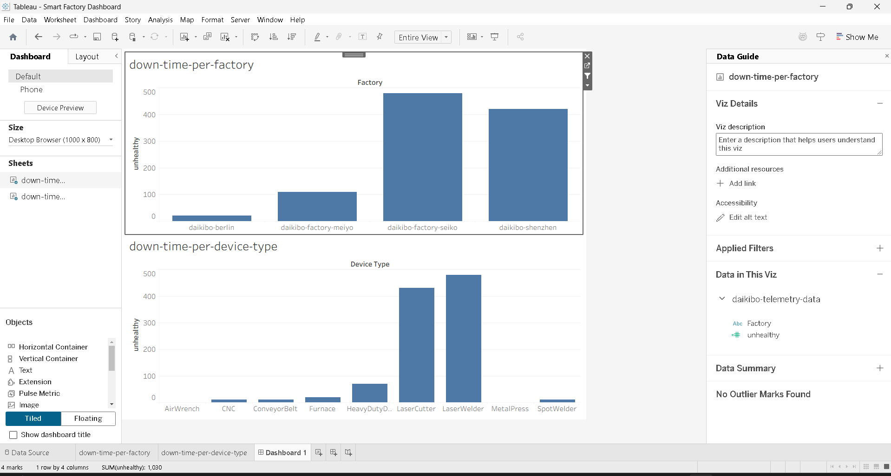

# 📊 Smart Factory Dashboard: Downtime Analysis

This project focuses on analyzing factory operations to identify **which factory has the highest downtime** using an interactive dashboard built in Tableau.

---

## 🔗 Live Dashboard
[View Interactive Dashboard] https://public.tableau.com/app/profile/avinash.ss/viz/SMART_FACTORY/Dashboard1?publish=yes

---

## 📊 Dashboard Preview

---

## 🚀 Project Overview
In industrial environments, downtime directly impacts productivity and efficiency.  
This dashboard provides a clear comparison of multiple factories and highlights the ones with the highest downtime, enabling faster and data-driven decision-making.

---

## 🎯 Objectives
- Identify the factory with the highest downtime  
- Compare downtime across multiple factories  
- Analyze machine health (Healthy vs Unhealthy)  
- Improve operational efficiency through insights  

---

## 📌 Features
- Factory-wise downtime comparison  
- Device-level downtime analysis  
- Interactive and easy-to-understand visuals  
- Clear identification of underperforming factories  

---

## 🛠️ Tools & Technologies
- Tableau (Data Visualization)  
- Excel / JSON (Data Source)  

---

## 📂 Project Files
- `Smart Factory Dashboard.twbx` → Tableau packaged workbook  
- `factory.png` → Dashboard preview image  

---

## 📈 Key Insights
- Identified the factory with the highest downtime  
- Highlighted patterns in machine failures  
- Enabled quick identification of performance issues  

---

## 🧠 What I Learned
- Building interactive dashboards in Tableau  
- Converting live data to extract for publishing  
- Transforming raw data into meaningful insights  
- Presenting data effectively for decision-making  

---

## 🔮 Future Improvements
- Real-time data integration  
- Predictive maintenance using machine learning  
- Advanced KPI tracking  

---

## 👨‍💻 Author
**Avinash SS**
